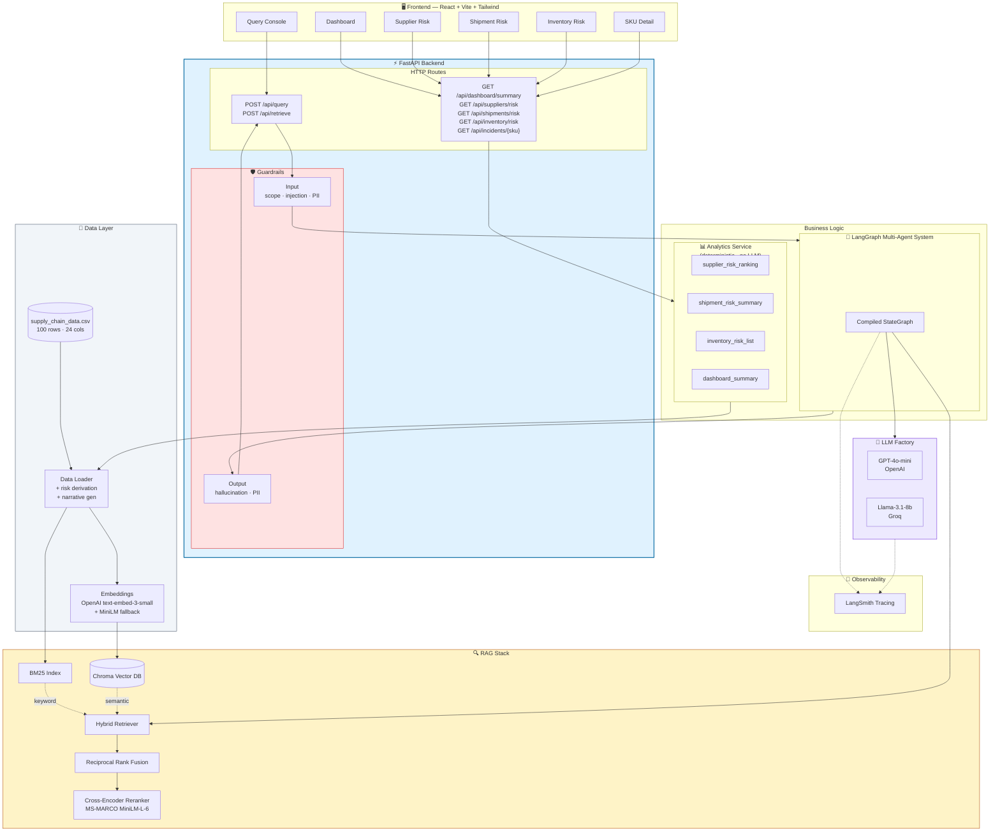
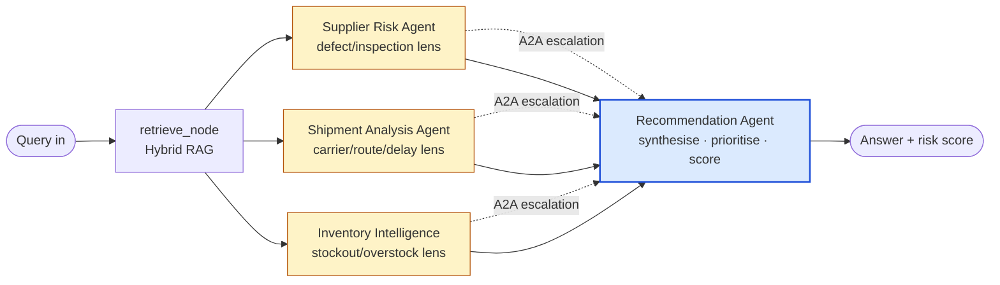
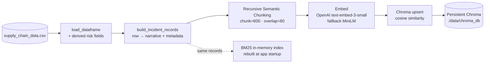

# Architecture

Three diagrams: **system layers**, **multi-agent flow**, and **ingestion pipeline**.
All Mermaid sources render natively on GitHub and VS Code (Markdown Preview).

---

## 1. System architecture (layered view)

---

## 2. Multi-agent flow (LangGraph topology)

**How it works.** `retrieve_node` runs once, then LangGraph fans out to the
three specialist agents in parallel. Each specialist analyses the *same* retrieved
context through its own lens and writes its finding into shared state. If a
specialist sees red flags it pushes an entry onto the `escalations` reducer
list — the A2A (agent-to-agent) channel. LangGraph waits for all three to
finish before invoking the **Recommendation Agent**, which reads every
specialist's finding plus the full escalation list and produces one prioritised,
explainable plan.

---

## 3. Ingestion pipeline

**Why per-row narratives?** The source data is structured CSV, but the
retrieval/embedding layer wants language. The data loader converts each row
into a compact prose record that mentions every field (e.g.
*"SKU24 (skincare) supplied by Supplier 2 in Mumbai. Stock level 4 units
(stockout_risk); Inspection Pending; defect rate 3.69%..."*). This makes
both BM25 and semantic search effective without losing structured filters,
which we expose as Chroma metadata.

---

## Component reference

| Module | Path | Responsibility |
| --- | --- | --- |
| Data loader | `app/services/data_loader.py` | CSV → enriched DF → IncidentRecord (narrative + metadata) |
| Chunking | `app/services/chunking.py` | Recursive semantic split (LangChain) |
| Embeddings | `app/services/embeddings.py` | OpenAI primary, SentenceTransformer fallback |
| Vector store | `app/services/vector_store.py` | Chroma persistent + metadata filter |
| BM25 | `app/services/bm25_index.py` | In-memory keyword index + metadata filter |
| Reranker | `app/services/reranker.py` | Lazy-loaded MS-MARCO cross-encoder |
| Retriever | `app/services/retriever.py` | Chroma + BM25 → RRF → rerank |
| Analytics | `app/services/analytics.py` | Deterministic aggregations for dashboard |
| Guardrails | `app/services/guardrails.py` | Input + output validation, PII redaction |
| Agents | `app/agents/{state,nodes,prompts,graph}.py` | LangGraph multi-agent system |
| LLM factory | `app/agents/llm.py` | GPT-4o-mini primary, Groq Llama fallback |
| Tracing | `app/core/tracing.py` | LangSmith env wiring |
| Eval | `backend/scripts/eval.py` + `eval_golden.py` | DeepEval golden test set |
